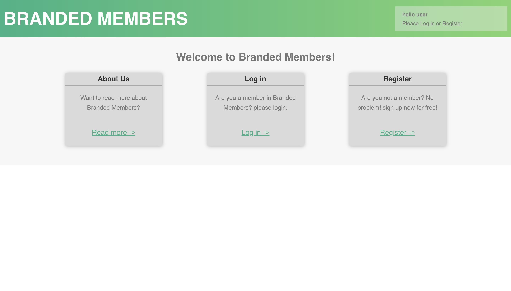

# Branded Members
Branded Members is an assignment for a job interview to [https://www.branded.co.il](https://www.branded.co.il)

## How to engage the app:
The project has 2 servers, the frontend (react) and the backend (express).
In addition the project uses a mongo db database.

### Back-end (the database):
First of all you need to cd into the back-end directory, and:
 - Run `npm install` to download the dependencies.
 - Run `node server.js` to start the server.

### Front-end (the interface):
Now, cd back and go to the front-end directory, and:
 - Run `npm install` to download the dependencies.
 - Run `npm start` to start the fron-end server.

### MongoDB:
Start the database with `brew services start mongodb-community@4.4`.
